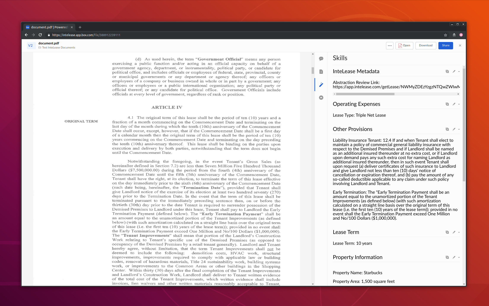

# InteLease Box Skill

[InteLease](https://intelease.com) is a an automatic due diligence platform, which quickly and accurately summarizes and abstracts your legal documents.

This [Box Skill](https://www.box.com/skills) allows InteLease to automatically summarize the user's Box PDF documents, with no effort from the user.



## Quick Run

### Dependencies

#### Serverless

Install [Serverless](https://serverless.com/framework/docs/providers/google/guide/installation/) globally, with the provider being Google Cloud Functions.

#### Google Cloud Credentials

The Serverless documentation also walks through how to get the Google Cloud credentials.

#### Node.js

As part of the Serverless installation, also will need to install Node.

### Deploy the Skill

Get the code locally.

`git clone https://github.com/intelease/intelease-box-skill.git`

Get the node modules for the main script.

`cd intelease-box-skill && npm install`

Get the node modules for the Skills kit library.

`cd skills-kit-library && npm install`

Update your Google Cloud account details and point to your Google credentials json file, in `serverless.yml`.

```yaml
provider:
  ...
  project: # <TODO: INSERT_GCLOUD_PROJECT_NAME>
  # the path to the credentials file needs to be absolute
  credentials: # <TODO: INSERT_PATH_TO_GCLOUD_CREDENTIALS_JSON_FILE>
  region: # <TODO: INSERT_GCLOUD_REGION>
```

Add your InteLease OAuth2.0 access token to `serverless.yml`.

```yaml
custom:
  variables:
    itlsAuthToken: # <TODO: INSERT_INTELEASE_OAUTH_ACCESS_TOKEN>
```

Deploy the serverless functions.

`sls deploy -v`

After this completes, you will see both invocation URLs--the one that Box needs to send data to and the one that InteLease needs to send data to.

### Set the Invocation URLs

Finally, the last steps are to configure the invocation URLs.

#### Box

This is [how to configure your Box skill](https://developer.box.com/docs/configure-a-box-skill) with its invocation URL, in Box.
Insert the URL endpoint for the `processBoxFile` function here.

#### InteLease

Tell InteLease where to return its processed document summary, by inserting, in `serverless.yml`, the URL endpoint for the `writeBoxCards` function.

```yaml
custom:
  variables:
    ...
    itlsRequestUrl: TODO # <TODO: INSERT_INTELEASE_REQUEST_URL>
```

And now, re-deploy the functions.

`sls deploy -v`

## Architecture

This Skill is triggered when the user uploads, moves, or copies a `PDF` file in the relevant Box folders.
The skill is implemented by 2 serverless functions, instead of 1 long-running function.

**1) Send Box File to InteLease**

This function is called by the Box skill initially.
It sends the Box file and relevant metadata to InteLease for processing. 
This function exits after sending the data to InteLease.

**2) Write InteLease Summary to Box Skill Cards**

This function is called by InteLease, after it finishes automatically processing a Box file (in less than 10 minutes).
It retrieves the provisions that InteLease found and writes them onto [Transcript Cards](https://github.com/box/box-skills-kit-nodejs/tree/master/skills-kit-library#skillswriter) for the Box file.
This function exits after writing the Box skill cards.

## Frequently Asked Questions

### Who might find this skill useful? 

The people that would find this skill most helpful would be lawyers, paralegals, or executives at companies with large amounts of legal documents to review.
Such institutions can include law firms, REITS, government offices, etc.

However, anyone with legal documents stored in Box can use this skill.
Purchasing a house? Quickly get a summary of the associated legal documents without spending thousands in legal fees.

### How can I get the InteLease access token?

InteLease does not offer a public API, so please reach out to InteLease for partnership.
You can email us directly at <info@intelease.com>.

### What actionable insights does this skill provide for my documents?

The first card InteLease provides is titled "InteLease Metadata", which shows the Box user at least the InteLease abstraction link where the user can interactively review this document's summary himself.
The rest of the cards are based on the user's own choice on InteLease of the provisions he wants on his summary form.
The user can choose from common existing forms, or create own custom form from hundreds of existing or new provisions.
