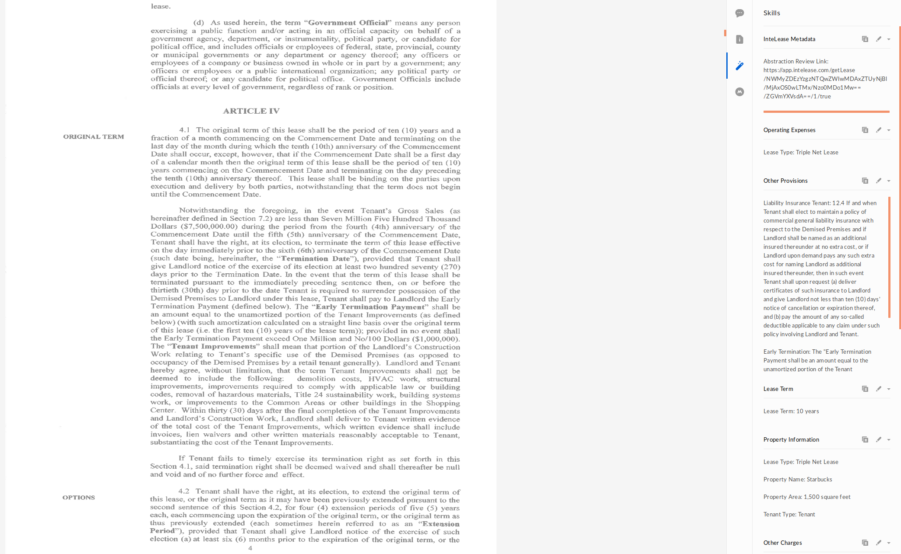

# InteLease Box Skill

[InteLease](https://intelease.com) is a an automatic due diligence platform.
InteLease quickly and accurately summarizes and abstracts your legal documents.

This [Box Skill](https://www.box.com/skills) allows InteLease to automatically summarize the user's Box documents, with no effort from the user.

## Quick Run

### Dependencies

#### Serverless

Install [Serverless](https://serverless.com/framework/docs/providers/google/), with the provider being  [Google Cloud Functions](https://cloud.google.com/functions/).

#### Google Cloud Credentials

The Serverless documentation also walks through how to get the credentials for [Google Cloud Platform](https://cloud.google.com/).

#### Node Package Manager

Install [NPM](https://www.npmjs.com/).

### Deploy the Skill

Get the code locally.

`git clone https://github.com/intelease/intelease-box-skill.git`

Get the node modules for the main script.

`cd intelease-box-skill && npm install`

Get the node modules for the Skills kit library.

`cd skills-kit-library && npm install`

Update your Google Cloud account details and point to your Google credentials json file, in `serverless.yml`.

Add your InteLease OAuth2.0 access token to `serverless.yml`.

Deploy the serverless function.

`sls deploy -v`

## Architecture

This Skill is triggered when the user uploads, moves, or copies a PDF file in the relevant Box folders.
The skill is implemented by 2 serverless functions, instead of 1 long-running function.

**1) Send Box File to InteLease**

This function is called by the Box skill initially.
It sends the Box file and relevant metadata to InteLease for processing. 
This function exits after sending the data to InteLease.

**2) Write InteLease Summary to Box Skill Cards**

This function is called by InteLease, after it finishes automatically processing a Box file (in less than 10 minutes).
It retrieves the provisions that InteLease found and writes them onto [Transcript Cards](https://github.com/box/box-skills-kit-nodejs/tree/master/skills-kit-library#skillswriter) for the Box file.
This function exits after writing the Box skill cards.

## Notes about InteLease

InteLease does not offer a public API, so please reach out to InteLease for partnership, to obtain an access token.

The first card InteLease provides is titled "InteLease Metadata", which shows the Box user at least the InteLease abstraction link where the user can interactively review this document's summary himself.
Based on the user's own choice on InteLease of the provisions he wants on his summary form (he can choose from hundreds of existing provisions or create his own), the rest of the extracted clauses and provisions from his document are placed in subsequent Transcript cards.
